# Exercise 7: Create a master image for WVD

In this exercise we are going to walk through the process of creating a master image for your WVD host pools. The basic concept for a master image is to start with a clean base install of Windows and layer on mandatory updates, applications and configurations. There are many ways to create and manage images for WVD. The steps covered in this exercise are going to walk you through a basic build and capture process that includes core applications and recommended configuration options for WVD.

## **Task 1: Create a new Virtual Machine in Azure**

1. On the Azure portal home page, Select Create a resource.

2. Search and select **Microsoft Windows 10**.

3. From dropdown menu select **Windows 10 Enterprise multi-session, Version 1909** and click on create **Create**.

4. Provide the below configuration for the virtual machine, and click on **Review + create** and then click on **create**.

- Name: wvdwin10
- Region: (default region of resource group)
- Image: **Windows 10 Enterprise multi-session, Version 1909-Gen1**
- size: Standard_D2s_v3
- Username: azuser
- Password: Azure1234567
- Public inbound ports: select **Allow selected ports**
- Select inbound ports: RDP(3389)
- **Click** on checkbox saying "I confirm I have an eligible Windows 10 license with multi-tenant hosting rights."

5. After deployment of virtual machine completes, click on **Go to resource**.

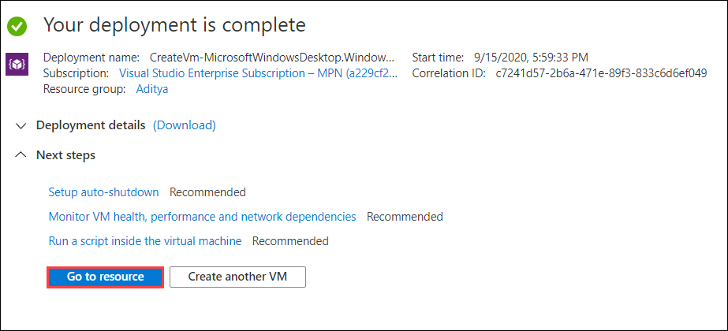

6. Click on **Connect** and select **RDP** from the dropdown.

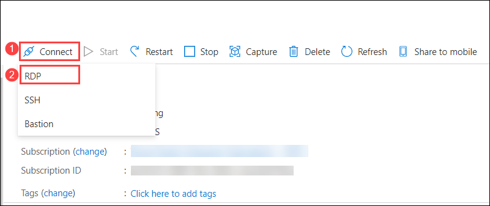

7. Click on **Download RDP file**.

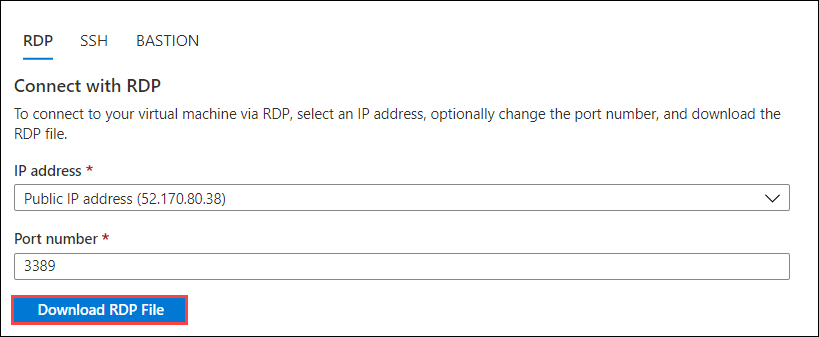

8. Click on the downloaded RDP file to open it.

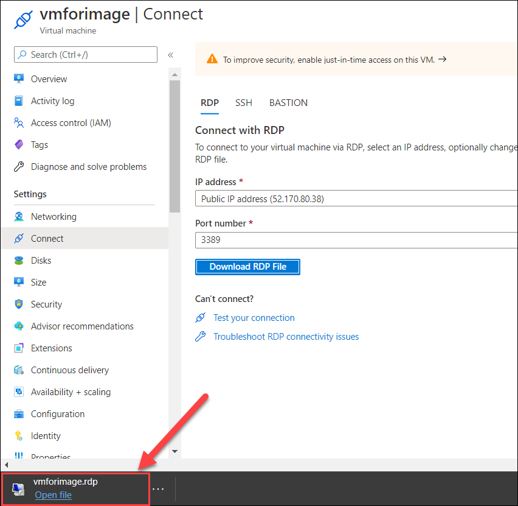

9. Now in the following RDP client window click on **Connect** to esablish a RDP connection to your virtual machine.

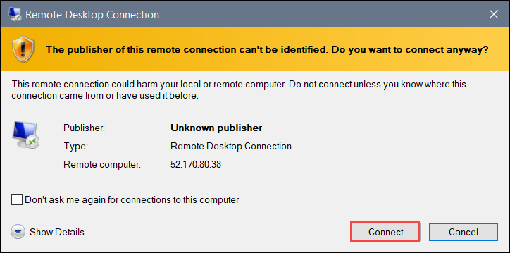

10. Now enter your virtual machine *credentials* and click **OK**.

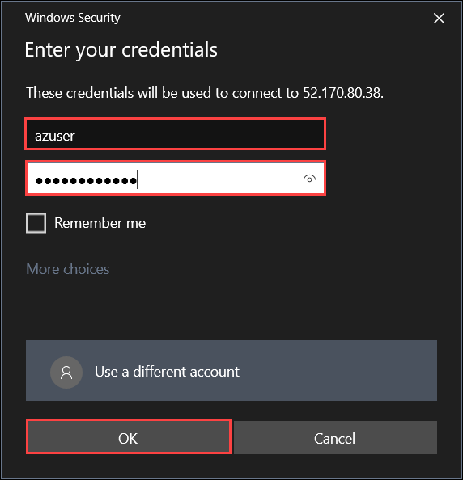

11. In virtual machine go to **Start** and click on **Settings**.

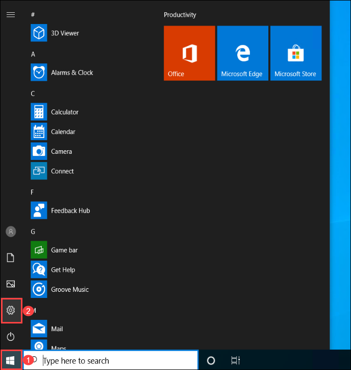

## **Task 2: Run Windows Update**

Despite the Azure support teams best efforts, the Marketplace images are not always up to date. The best and most secure practice is to keep your master image up to date.

1. From your virtual machine inside *settings* select **Updates & Security**.

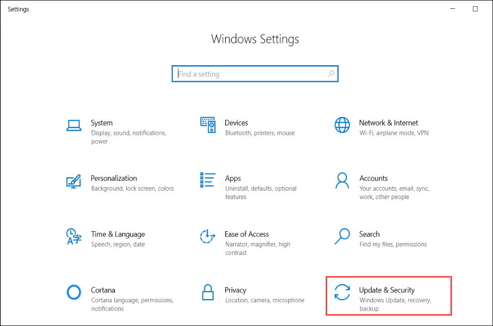

2. Click on **Download** to download and install windows updates.

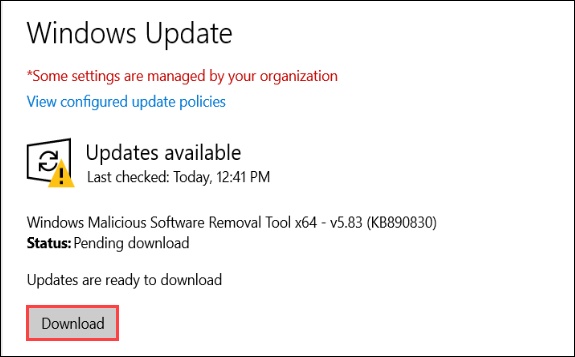

## **Task 3: Prepare WVD image**

**Introduction to the script**

The authors for this content have developed a scripted solution to assist in automating some common baseline image build tasks. The script includes a UI form, enabling you to quickly select which actions to perform. The end result will be a custom master image that incorporates Microsoft's main business applications, along with the necessary policies and settings for an optimized user experience.

The script and related tools are maintained in GitHub.

For additional documentation about the script (e.g. parameters, functions, etc.), refer to the comments in Prepare-WVDImage.ps1.

For troubleshooting script execution, refer to the following log directory on the target machine: C:\Windows\Logs\ImagePrep.

This script leverages the Local Group Policy Object (LGPO) tool in the Microsoft Security Compliance Toolkit (SCT) to apply settings in the image. The settings are documented and exported on the target machine under C:\Windows\Logs\ImagePrep\LGPO. This approach was taken to simplify troubleshooting, enabling you to leverage Group Policy Results.

The UI form offers the following actions:

**Office 365 ProPlus**

-   Install the **latest** version of Office 365 ProPlus monthly channel.

-   Apply recommended settings.

-   Source documentation: [Install Office on a master VHD image](https://docs.microsoft.com/en-us/azure/virtual-desktop/install-office-on-wvd-master-image).

**OneDrive for Business**

-   Install the **latest** version of OneDrive for Business *per-machine*.

-   Source documentation: [Install Office on a master VHD image](https://docs.microsoft.com/en-us/azure/virtual-desktop/install-office-on-wvd-master-image).

**Microsoft Teams**

-   Install the **latest** version of Microsoft Teams *per-machine*.

-   Source documentation: [Use Microsoft Teams on Windows Virtual desktop](https://docs.microsoft.com/en-us/azure/virtual-desktop/teams-on-wvd).

**Microsoft Edge Chromium**

-   Install the **latest** version of Microsoft Edge Enterprise.

-   Apply recommended settings.

-   Source documentation: [Deploy Microsoft Edge using System Center Configuration Manager](https://docs.microsoft.com/en-us/deployedge/deploy-edge-with-configuration-manager).

**FSLogix Profile Containers**

-   Install the **latest** version of the FSLogix Agent.

-   Apply recommended settings.

-   Source documentation: [Download and Install FSLogix](https://docs.microsoft.com/en-us/FSLogix/install-ht).

**OS Settings**

-   Apply the recommended WVD settings for image capture.

-   Source documentation: [Prepare and customize a master VHD image](https://docs.microsoft.com/en-us/azure/virtual-desktop/set-up-customize-master-image).

-   Apply the recommended settings for capturing an Azure VM.

-   Source documentation: [Prepare a Windows VHD or VHDX to upload to Azure](https://docs.microsoft.com/en-us/azure/virtual-machines/windows/prepare-for-upload-vhd-image). 

-   Run Disk Cleanup.

-   Source documentation: [cleanmgr](https://docs.microsoft.com/en-us/windows-server/administration/windows-commands/cleanmgr). 

**Running the script**
1. Now inside your virtual machine click on **Start** and open **Microsoft edge browser**.

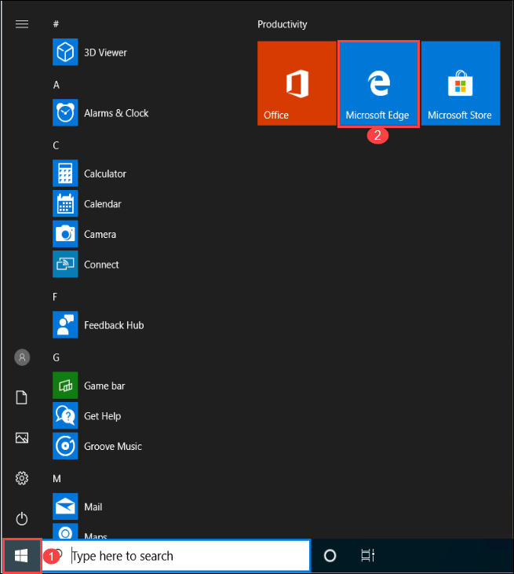

2. Copy and paste the URL below and click on **Save** to download the *Customizations.zip* file.

`https://minhaskamal.github.io/DownGit/#/home?url=https://github.com/shawntmeyer/WVD/tree/master/Image-Build/Customizations`

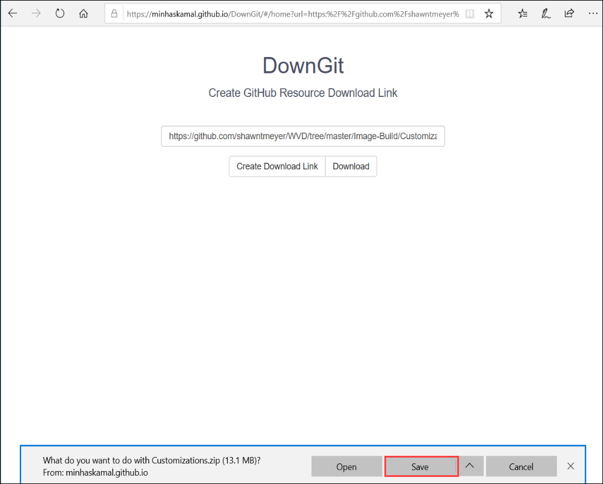

3. Open file explorer and go to *Downloads directory*, there **right click** on *Customizations.zip* and select **Extract All**.

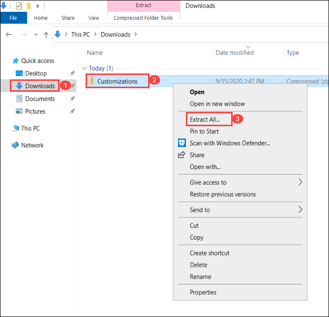

4. A new window will open, click on **Extract**.

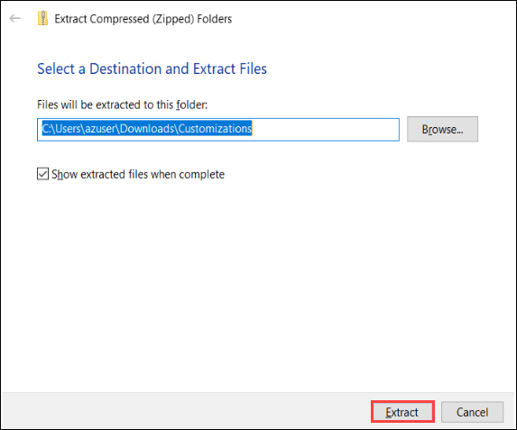

5. Now on your virtual machines taskbar search for *Powershell*, and then select **Run as administrator**.

6. Use the following command to navigate to "C:\Users\(loginaccount)\Documents\Customizations".

` cd C:\Users\(LoginAccount)\Documents\Customizations\Customizations `

7. Run the following command to allow for script execution.

` Set-ExecutionPolicy -ExecutionPolicy Bypass -Scope Process -Force `

8. Execute the script by running the following command.

` .\Prepare-WVDImage.ps1 -DisplayForm `

9. This will trigger the powershell to launch an application, here select the required applications
