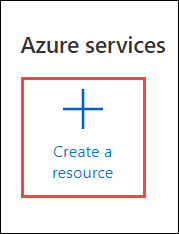

# Exercise 7: Create a master image for WVD

In this exercise we are going to walk through the process of creating a master image for your WVD host pools. The basic concept for a master image is to start with a clean base install of Windows and layer on mandatory updates, applications and configurations. There are many ways to create and manage images for WVD. The steps covered in this exercise are going to walk you through a basic build and capture process that includes core applications and recommended configuration options for WVD.

## **Task 1: Create a new Virtual Machine in Azure**

1. On the Azure portal home page, Select Create a resource.

2. Search and select **Microsoft Windows 10**.
